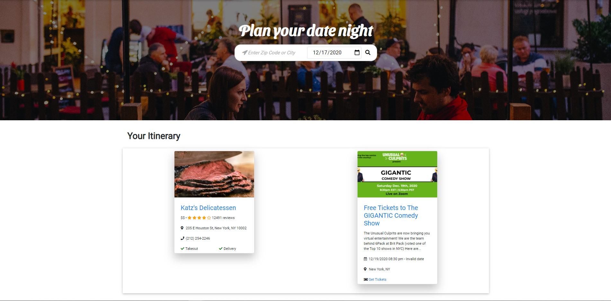

# Date-Night &#128197;

A full stack web application that finds events and restauraunts in your given location.

## Table of contents

- [ &#128161; Purpose](#-purpose)
- [&#x1f527; Technologies & Tools](#-technology--tools)
- [&#x1f4f2; Features](#-features)
- [:framed_picture: Images](#framed_picture-images)

## &#128161; Purpose

To assist the average person in searching multiple activity options that are available in new and familiar places to make it easier to go out and have some fun with your significant other.

## &#x1f527; Key Technology & Tools

- HTML5
- CSS3
- JavaScript
  - Handlebars.js
  - Node.js
  - Express.js
  - Passport.js
- Bootstrap
- Sequelize
- API's:
  - Yelp
  - Auth0

## &#x1f4f2; Features

- Shows result based on your:
  - Location
  - Interests
  - Budget
- Shows the pricing of each event
- Information that will be displayed
  - Image
  - Price
  - Rating
  - Location
  - Phone Number

## :framed_picture: Images

