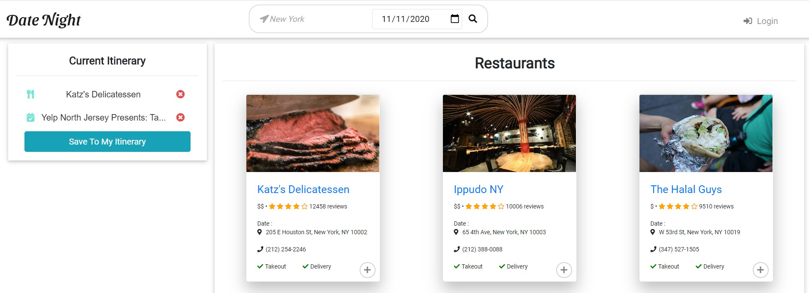
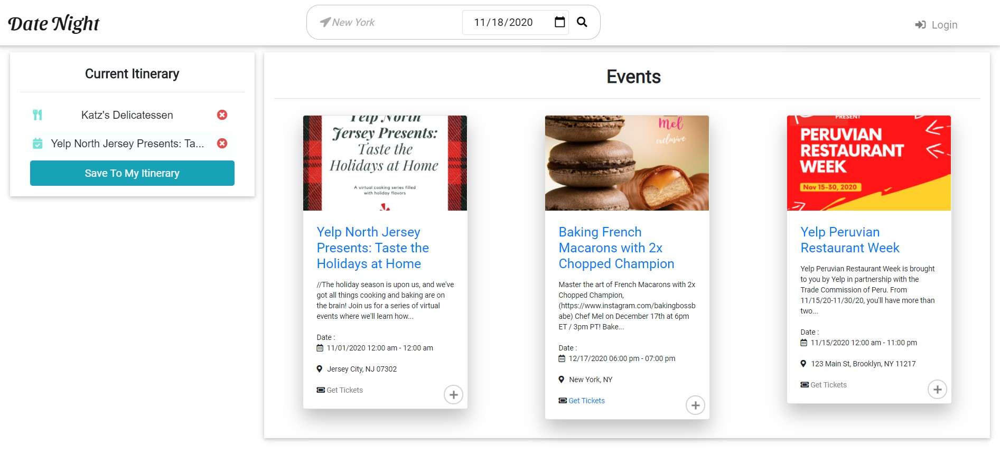

#  Date-Night &#128197;

## Table of contents
* [ &#128161; Purpose](#-purpose)
* [&#x1f527; Technologies & Tools](#-technology--tools)
* [&#x1f4f2; Features](#-features)

A web app that finds events that are happening that day depending on your location.

## &#128161; Purpose
To assist the average person in searching multiple activity options that are available in new and familiar places to make it easier to go out and have some fun with your significant other.

## &#x1f527; Technology & Tools
- HTML5
- CSS3
  - Parralax
  - Animate.css
- Bootstrap
- JavaScript
  - Handlebars
  - Node.js
  - Express.js
- JQuery
- JSON
- AJAX
- API
  - Yelp
- Sequelize

## &#x1f4f2; Features
- Shows result based on your:
  - Location
  - Interests
  - Budget
- Shows the pricing of each event
- Information that will be displayed
  - Image
  - Price
  - Rating
  - Location
  - Phone Number
  
